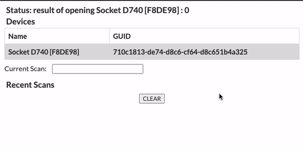

# SingleEntryReact

SingleEntryReact is a React boilerplate app using the Socket Mobile JavaScript Capture Module. If you are looking for the Vanilla JS project example, the repo can be found [here](https://github.com/SocketMobile/singleentry-js).

It shows how to use the Socket Mobile CaptureJS SDK to receive the decoded data from the Socket Mobile devices into an input box. 

The connection state of the Socket Mobile device is shown in a status field at the top of the app.

## Requirements
1. You will need your Socket Mobile developer ID as well as an app ID. Your developer ID can be found under your developer profile when you log into the [Socket Mobile Developer Portal](https://www.socketmobile.com/developers/portal). Then you need to [create your appKey](https://www.socketmobile.com/developers/portal/application-details/appkey-registration). For platform, select Web. For Language/Capture Client, select JavaScript. Your bundleId needs to be in the format of `socketmobile.com.yourappname`.
2. The scanner needs to be paired with your devices in Application Mode. This can be done using the Socket Mobile Companion app (recommended), which can be downloaded from the [App Store](https://apps.apple.com/us/app/socket-mobile-companion/id1175638950). To pair your scanner in Application Mode without using Companion app, follow the instructions at: ConfigureInAppMode.

## Install

When ou clone the repo, remember to run `npm install`. If you want to temporarily host your app securely, you can install `ngrok` and follow the directions from this blog post (link to my blog post about using SimpleHTTPServer and ngrok).

## Usage
To run app on your laptop, connect an android device to your laptop so you can use `adb`. More in a moment. Then, use the Socket Mobile Companion app to connect your scanner to your attached device. Once you have successfully connected your scanner to your device, configure your credentials for your app (see below) and then in your terminal, in the project root run `adb forward tcp:18481 tcp:18481`. 

The boilerplate React references the file `credentials.js`. The `.gitignore` file ignores this file as it is meant to act as an environment variable file, protecting your credentials from being exposed in a public GitHub repository. In this file is where you are to include your developerId, appKey and appId. See an example `credentials.js` file below.

```
const CREDENTIALS = {
    appId: "web:socketmobile.com.yourappname",
    developerId: 'your-d3v-id',
    appKey: 'alphanum3r1cappk3y'
}
```

Then you can access those variables in your `App.js` like so...
```
const {appId, developerId, appKey} = CREDENTIALS;

let appInfo = {
    appId,
    developerId,
    appKey
};
```

NOTE: This usage is optional and you can remove references to `credentials.js` and `CREDENTIALS` and use your credentials directly in your `index.js` file like so...

```
let appInfo = {
    appId: "web:socketmobile.com.yourappname",
    developerId: "your-d3v-id",
    appKey: 'ALPHAnum3r1cAPPk3y'
};
```

The capture initialization takes place in an `useEffect` hook to lauch the capture request when the component mounts.

```
useEffect(() => {
    const appInfo = {
      appId,
      developerId,
      appKey,
    };
    
    capture
      .open(appInfo, onCaptureEvent)
      .then(() => {
        setStatus('capture open success');
      })
      .catch(err => {
        myLogger.error(err);
        setStatus(`failed to open Capture: ${err}`);
        // this is mostly for Android platform which requires
        // Socket Mobile Companion app to be installed
        if (err === SktErrors.ESKT_UNABLEOPENDEVICE) {
          setStatus('Is Socket Mobile Companion app installed?');
        }
      });
    return closeCapture;
  }, []);
```

`onCaptureEvent` is used similarly to how it is used in the Vanilla JS example. It handles the device initialization and applies three conditionals; detecting devices, removing devices and processing scanned data.

```
const onCaptureEvent = (e, handle) => {
    const {CaptureEventIds, Capture} = SocketMobile
    if (!e) {
        return;
    }
    switch (e.id) {
        case CaptureEventIds.DeviceArrival: //detecting devices; scanner connects to companion/device
        ...
        break
        case CaptureEventIds.DeviceRemoval: //removing devices; scanner connects to companion/device
        ... 
        break
        case CaptureEventIds.DecodedData: //processing captured data; executed when you scan a code
        ...
        break
    }
}
```

We've provided some logic to handle adding devices, removing devices, scanning items and storing those scan results (and connected devices) in state. Below is what your boilerplate should look like after connecting a scanner and scanning a few tags.

